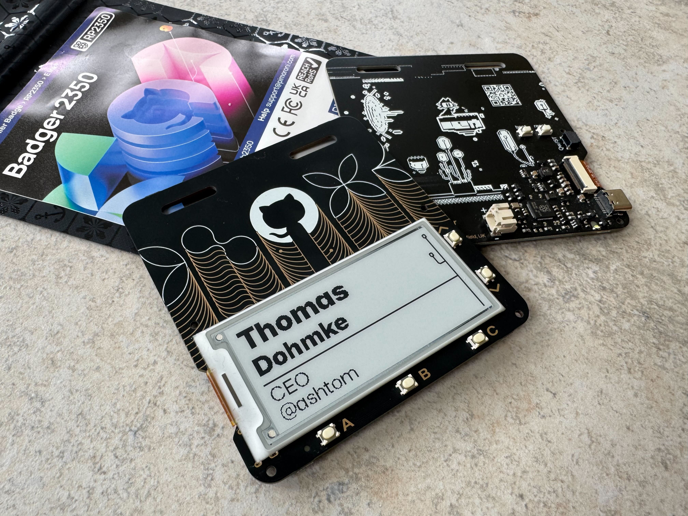

# Let's get Hacking!

Hello 👋 - if you've landed at this repo it's probably because you are one of the lucky people at GitHub Universe 2024 who has been handed a hackable conference badge and you are now wondering what the heck this thing is and how you can get started.

## What is it?

The GitHub Universe Badger is a hackable conference badge running MicroPython on a RP2350a microprocessor and comes with a built in 2.9" E Ink® display (296 x 128 pixels) along with a battery connector, 5 user configurable buttons and a QT/Stemma expansion port for connecting additional sensors and accesories.  The GitHub Universe Badger is a custom version of the [Badger2040](https://learn.pimoroni.com/article/getting-started-with-badger-2040) made by our wonderful friends at [Pimoroni](https://pimoroni.com/). Electronically we kept it pretty similar so that all the open source examples that you can find of cool things you can do with your Badger2040 you can do with your brand new GitHub Badger.  We just blinged up the PCB a bit, added the latest RP2350a microprocessor and installed some little easter eggs into the [BadgerOS](https://github.com/pimoroni/badger2040) image hung around your neck.

P.S. if you happen to have an electronic badge from Universe 2023 as well, most of the code provided in this repo will work on that older version too! Just one small note: the launcher on the 2023 model can only use JPEG files for app icons, while the 2024 also supports PNGs.

## How do I get started
If you want to just play with the badge you have, you can plug it into power via the USB-C connection.  However you can also power the device with a battery pack as it is extremely low power.

You can power over USB or via the JST power connector that can accept a 2xAAA battery pack ot standard 3.7v LiPo cell.

Once you have power, if you press and hold the A & C buttons simultaneously, you get into the secret menu of the badger operating system.  From there you can explore the installed applications including an eBook reader, ToDo list and image viewer.

## Yeah, yeah cool - how do I hack this thing?

To get started, read through [tutorial.md](tutorial.md), which will guide you through the process of setting up your development environment and loading MicroPython scripts onto your badge. If you've never used a Pimoroni badge before, start here!

Once you've learned the basics, explore the [examples](./examples) folder, which contains fun and engaging apps that you can load directly onto your badge, or use as inspiration to create your own.

Also take note of the [icons](./icons) folder. Each app you load onto your badge needs an icon, and these need to be in a very specific format (as explained in the [tutorial.md](tutorial.md)). While you can always choose to make your own icons, it may be easier/faster to just copy and rename one from this folder.

Lastly, the feature and function reference [2040reference.md](2040reference.md) contains detailed information about Badger programming. You don't need read it before trying out the tutorial -- but we wanted to make sure you had a copy in case you later decide to get deep into the world of Badger programming!

## I'm still not satisfied. What else can I do?

This is a full Raspberry Pi Pico device, so you aren't limited to MicroPython. If you want to entirely flash your firmware and turn your badger into a USB Macro Keyboard, or make it play Doom, then all that and more is possible!  We've deliberately left solderable exansion pins available on your badge as well as a serial QT/Stemma port so you can connect your badge to a whole ecosystem of sensors from the likes of [Adafruit](https://www.adafruit.com/) and [Pimoroni](https://pimoroni.com/).  To learn more about Stemma see this [excellent tutorial from Adafruit](https://learn.adafruit.com/introducing-adafruit-stemma-qt/what-is-stemma).

## Show it off!

After you've loaded a few examples onto your badge, have fun showing it off to others, and encourage them to come by the _Hack Your Badge_ station on the second floor of the Gateway Pavilion, or return to this repository at any time to explore further.

Happy hacking, and once again, thank you for being part of GitHub Universe 2024!

## How can I create my own custom event badge?

As well as the [Badger2040](https://learn.pimoroni.com/article/getting-started-with-badger-2040), there is a thriving community of badge hackers at open source and security events.  Be sure to check out [Badge.team](https://badge.team/) if you are thinking about creating your own.
